<h2>TensorFlow-FlexUNet-Image-Segmentation-PROMISE12-Prostate-Cancer (2026/05/23)</h2>
Sarah T. Arai 
Software Laboratory antillia.com  
This is the first experiment of Image Segmentation for <b>PROMISE12-Prostate-Cancer-Breast-US (Benign and Malignant)</b> based on 
our <a href="./src/TensorFlowFlexUNet.py">TensorFlowFlexUNet</a>
 (<b>TensorFlow Flexible UNet Image Segmentation Model for Multiclass</b>), and a 512x512 pixels PNG
 <a href="https://drive.google.com/file/d/1WohQwykERmJVYUgsEXajfMUZsltAUQp5/view?usp=sharing">
Augmented-PROMISE12-Prostate-Cancer-ImageMask-Dataset.zip</a>, which was derived by us from   
<a href="https://zenodo.org/records/8026660">
<b>PROMISE12: Data from the MICCAI Grand Challenge: Prostate MR Image Segmentation 2012
</b>
</a>
  

<b>Actual Image Segmentation for PROMISE12-Prostate-Cancer Images of 512x512 pixels</b> 
As shown below, the inferred masks predicted by our segmentation model trained by the dataset appear similar to 
the ground truth masks.
  
<table>
<tr>
<th>Input: image</th>
<th>Mask (ground_truth)</th>
<th>Prediction: inferred_mask</th>
</tr>
<tr>
<td>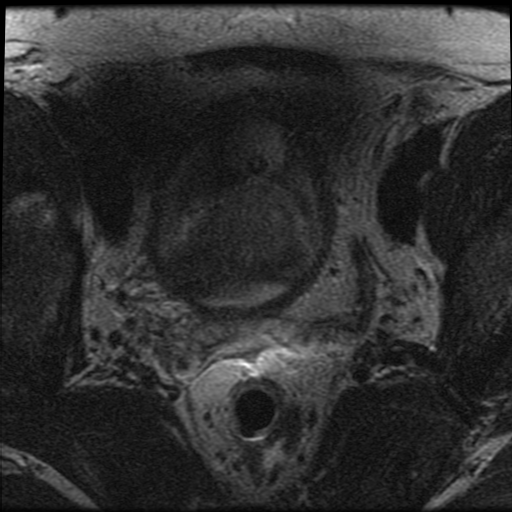</td>
<td>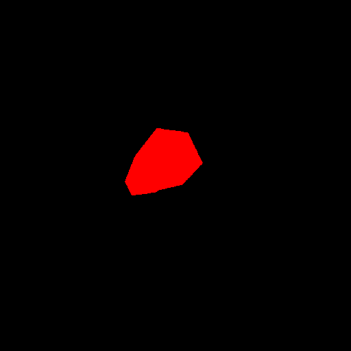</td>
<td></td>
</tr>

<tr>
<td>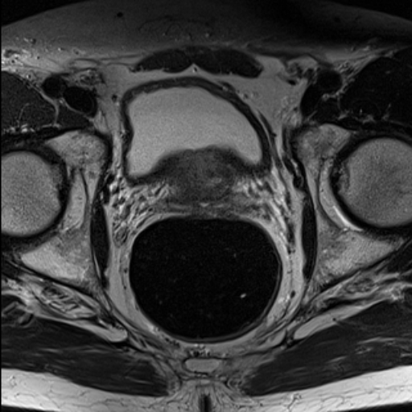</td>
<td></td>
<td>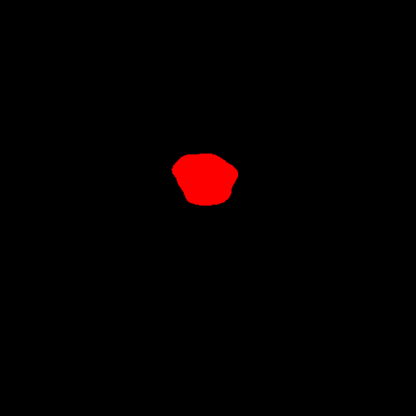</td>
</tr>

<tr>
<td>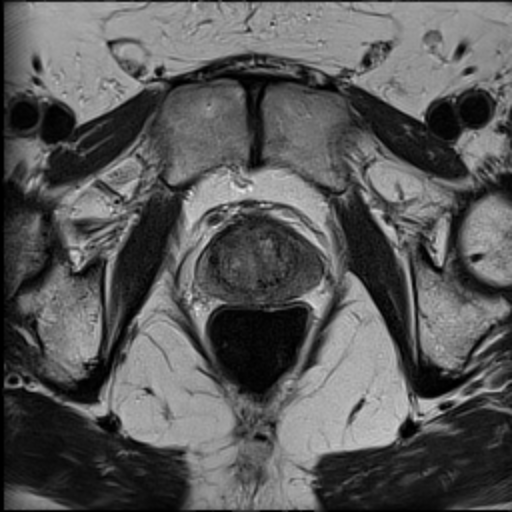</td>
<td></td>
<td></td>
</tr>
</table>

 
<h3>1. Dataset Citation</h3>
The dataset used here was derived from   
<a href="https://zenodo.org/records/8026660">
<b>PROMISE12: Data from the MICCAI Grand Challenge: Prostate MR Image Segmentation 2012
</b>
</a>
 
 
The following explanation was taken above zenodo web site.
  
<b>Description</b> 
This repository contains all data associated with the 
'Prostate MR Image Segmentation'-challenge 2012 on https://promise12.grand-challenge.org/. 
 The goal of this challenge was to compare interactive and (semi)-automatic segmentation algorithms 
 for MRI of the prostate. 
  
<b>Citation</b> 
Geert Litjens, Bram van Ginneken, Henkjan Huisman, Wendy van de Ven, Caroline Hoeks, Dean Barratt, 
& Anant Madabhushi. (2023).  
PROMISE12: Data from the MICCAI Grand Challenge: Prostate MR Image Segmentation 2012 [Data set]. 
In Medical Image Analysis (Updated the zip files, fixed some issues.,  
Vol. 18, Number 2, pp. 359?373).  
Zenodo. https://doi.org/10.5281/zenodo.8026660
  
<b>License Text</b> 
You can use this data for your research. If you do that it is mandatory to cite 
<a href="https://doi.org/10.1016/j.media.2013.12.002">https://doi.org/10.1016/j.media.2013.12.002</a>.
 
 
<h3>
2 PROMISE12-Prostate-Cancer ImageMask Dataset
</h3>
<h3>2.1 PROMISE12-Prostate-Cancer ImageMask Dataset</h3>
 If you would like to train this PROMISE12-Prostate-Cancer Segmentation model by yourself,
 please download the dataset from the google drive  
 <a href="https://drive.google.com/file/d/1WohQwykERmJVYUgsEXajfMUZsltAUQp5/view?usp=sharing">
Augmented-PROMISE12-Prostate-Cancer-ImageMask-Dataset.zip</a>
, expand the downloaded ImageMaskDataset and put it under <b>./dataset</b> folder to be
 
<pre>
./dataset
└─PROMISE12-Prostate-Cancer
    ├─test
    │   ├─images
    │   └─masks
    ├─train
    │   ├─images
    │   └─masks
    └─valid
        ├─images
        └─masks
</pre>
 
<b>PROMISE12-Prostate-Cancer Statistics</b> 
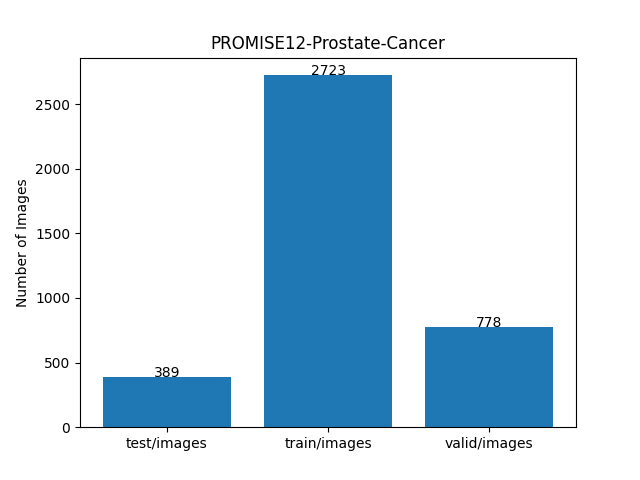 
 
As shown above, the number of images of train and valid datasets is large enough to use for the
 training set of our segmentation model.
 
 
<h3>2.2 Derivation of PROMISE12-Prostate-Cancer ImageMask Dataset</h3>
The folder of the original dataset is the following. 
<pre>
./8026660
└training_data
    ├─Case00.mhd
    ├─Case00.raw
    ├─Case00_segmentation.mhd
    ├─Case00_segmentation.raw
...
    ├─Case49.mhd
    ├─Case49.raw
    ├─Case49_segmentation.mhd
    └─Case49_segmentation.raw
</pre>
We generated a 512x512 pixels PNG master ImageMask dataset from all pairs of images (<b>Case*.mhd/Case*.raw</b>)
 and their corresponding segmentations (<b>Case*_segmentation.mhd/Case*_segmentation.raw</b>), and then our augmented 
 dataset from the master by using the following image deformation tools: 
<a href="https://github.com/sarah-antillia/Image-Deformation-Tool">Image-Deformation-Tool</a> 
<a href="https://github.com/sarah-antillia/Image-Distortion-Tool">Image-Distortion-Tool</a>  
 
<h3>2.3 Train Sample Images and Masks</h3>
<b>Train sample images</b> 
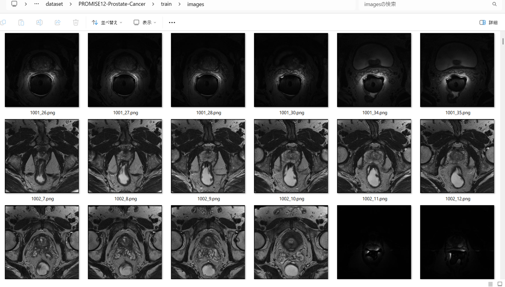
 
<b>Train sample masks</b> 
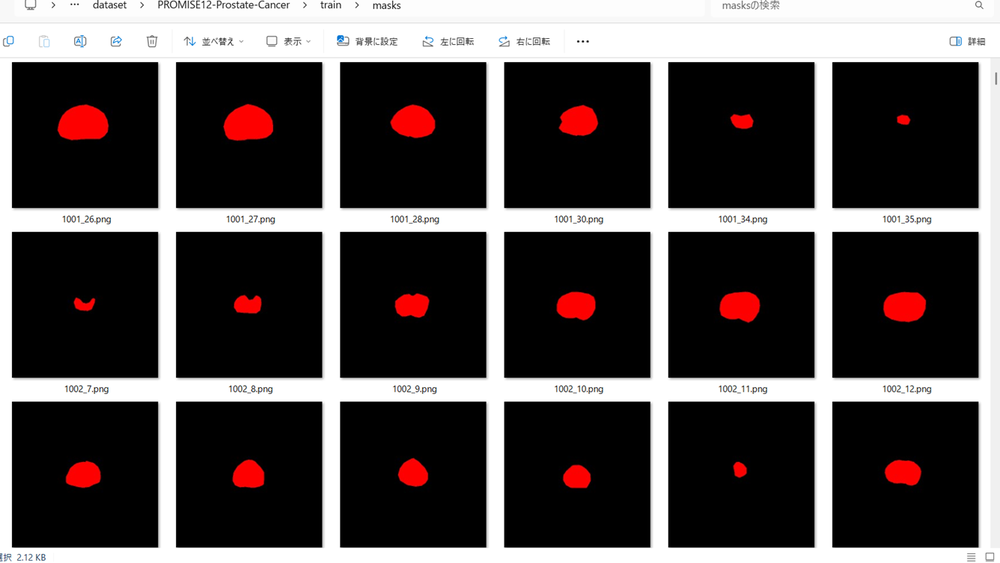
 
<h3>
3 Train TensorFlowFlexUNet Model
</h3>
 We trained PROMISE12-Prostate-Cancer TensorFlowFlexUNet Model by using the 
<a href="./projects/TensorFlowFlexUNet/PROMISE12-Prostate-Cancer/train_eval_infer.config"> <b>train_eval_infer.config</b></a> file.  
Please move to ./projects/TensorFlowFlexUNet/PROMISE12-Prostate-Cancer and run the following bat file. 
<pre>
>1.train.bat
</pre>
, which simply runs the following command. 
<pre>
>python ../../../src/TensorFlowFlexUNetTrainer.py ./train_eval_infer.config
</pre>

<b>Model parameters</b> 
Defined a small <b>base_filters = 16 </b> and large <b>base_kernels = (11,11)</b> for the first Conv Layer of Encoder Block of 
<a href="./src/TensorFlowFlexUNet.py">TensorFlowFlexUNet.py</a> 
and a large <b>num_layers = 8</b> (including a bridge between Encoder and Decoder Blocks).
<pre>
[model]
;You may specify your own UNet class derived from our TensorFlowFlexModel
model         = "TensorFlowFlexUNet"
image_width    = 512
image_height   = 512
image_channels = 3
input_normalize = True
normalization  = False
num_classes    = 2
base_filters   = 16
base_kernels   = (11,11)
num_layers     = 8
dropout_rate   = 0.05
dilation       = (1,1)
</pre>
<b>Learning rate</b> 
Defined a small learning rate.  
<pre>
[model]
learning_rate  = 0.00007
</pre>
<b>Loss and metrics functions</b> 
Specified "categorical_crossentropy" and <a href="./src/dice_coef_multiclass.py">"dice_coef_multiclass"</a>. 
<pre>
[model]
loss           = "categorical_crossentropy"
metrics        = ["dice_coef_multiclass"]
</pre>
<b>Dataset class</b> 
Specifed <a href="./src/ImageCategorizedMaskDataset.py">ImageCategorizedMaskDataset</a> class. 
<pre>
[dataset]
class_name    = "ImageCategorizedMaskDataset"
</pre>
 
<b>Learning rate reducer callback</b> 
Enabled learing_rate_reducer callback, and a small reducer_patience.
<pre> 
[train]
learning_rate_reducer = True
reducer_factor     = 0.4
reducer_patience   = 4
</pre>
<b>Early stopping callback</b> 
Enabled early stopping callback with patience parameter.
<pre>
[train]
patience      = 10
</pre>
<b>RGB Color map</b> 
Specifed rgb color map dict for PROMISE12-Prostate-Cancer 1+1 classes. 
<pre>
[mask]
mask_datatyoe    = "categorized"
mask_file_format = ".png"
;PROMISE12-Prostate-Cancerrgb color map dict for 1+1 classes.
;                      Cancer:red
rgb_map = {(0,0,0):0, (255, 0, 0):1 }
</pre>
<b>Infer section</b> 
<pre>
[infer] 
images_dir    = "./mini_test/images/"
output_dir    = "./mini_test_output/"
</pre>
<b>Epoch change inference callback</b> 
Enabled <a href="./src/EpochChangeInferencer.py">epoch_change_infer callback</a></b>. 
<pre>
[train]
epoch_change_infer       = True
epoch_change_infer_dir   =  "./epoch_change_infer"
num_infer_images         = 6
</pre>
By using this callback, on every epoch_change, the inference procedure can be called
 for 6 images in <b>mini_test/images</b> folder specified in <b>infer</b> section. This will help you confirm how the predicted mask changes 
 at each epoch during your training process.  
<!--
  
As shown below, early in the model training, the predicted masks from our UNet segmentation model showed 
discouraging results.
 However, as training progressed through the epochs, the predictions gradually improved. 
   
 -->
 
<b>Epoch_change_inference output at starting (epoch 1,2,3)</b> 
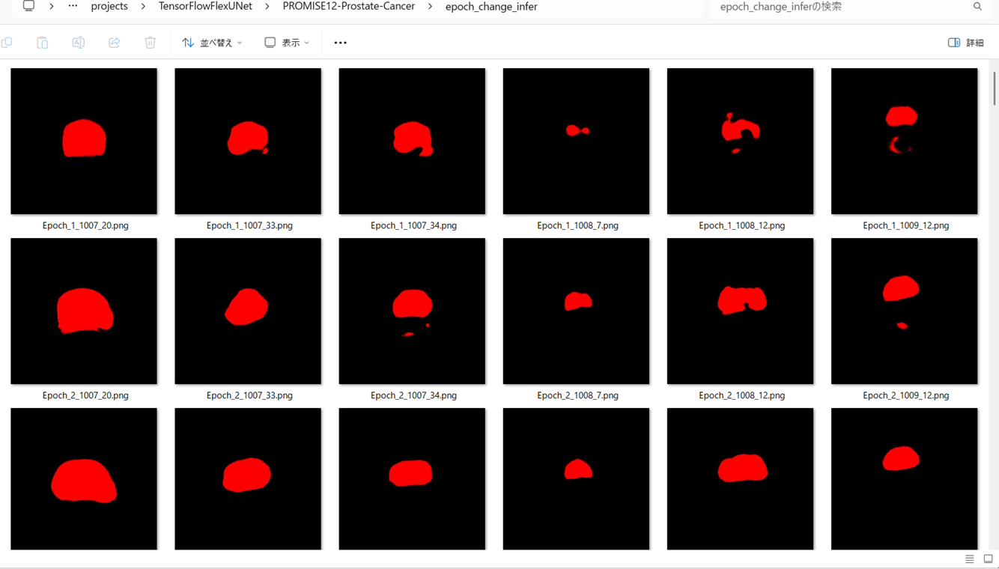 
 
<b>Epoch_change_inference output at middlepoint (epoch 18,19,20)</b> 
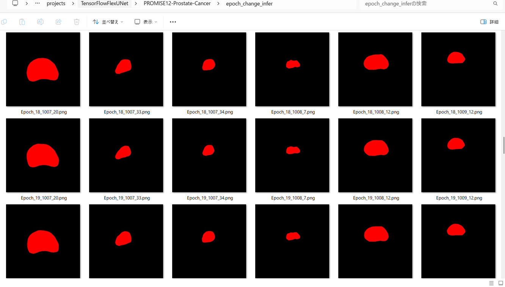 
 

<b>Epoch_change_inference output at ending (epoch 38,39,40)</b> 
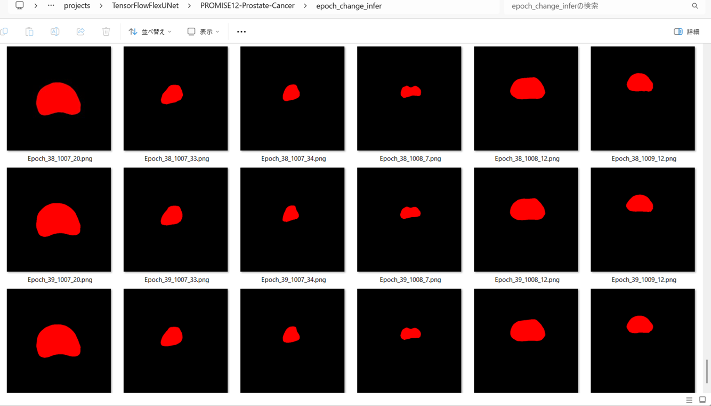 
 

In this experiment, the training process was terminated at epoch 40.  
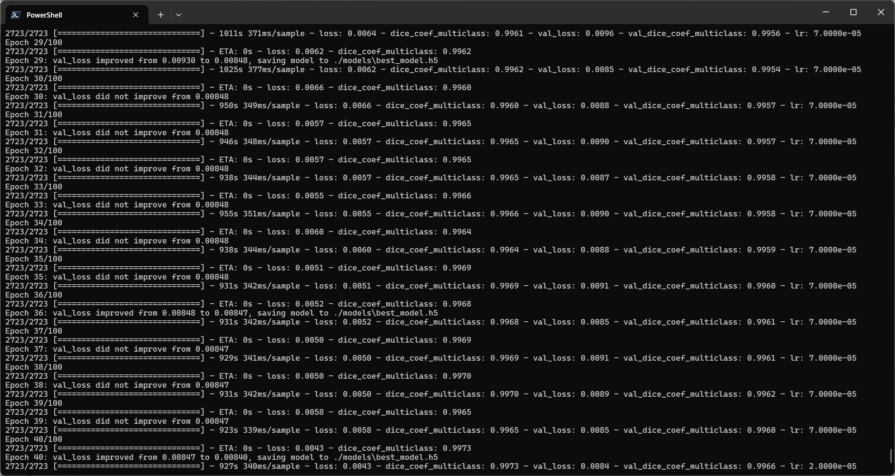 
 

<a href="./projects/TensorFlowFlexUNet/PROMISE12-Prostate-Cancer/eval/train_metrics.csv">train_metrics.csv</a> 
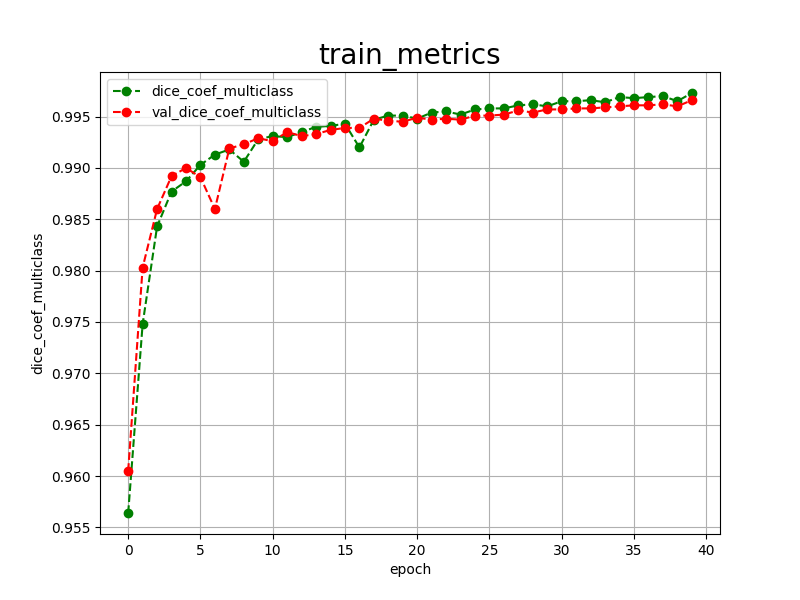 

 
<a href="./projects/TensorFlowFlexUNet/PROMISE12-Prostate-Cancer/eval/train_losses.csv">train_losses.csv</a> 
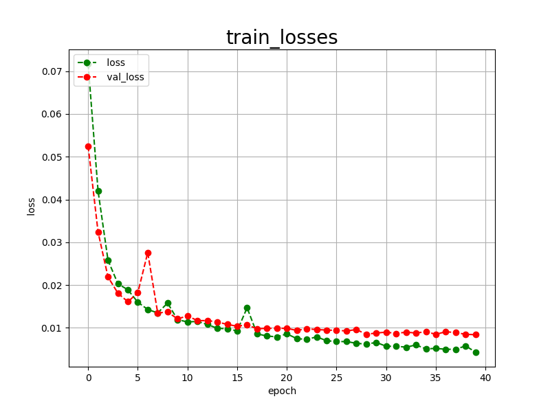 
 
<h3>
4 Evaluation
</h3>
Please move to <b>./projects/TensorFlowFlexUNet/PROMISE12-Prostate-Cancer</b> folder,
and run the following bat file to evaluate TensorFlowUNet model for PROMISE12-Prostate-Cancer. 
<pre>
>./2.evaluate.bat
</pre>
This bat file simply runs the following command.
<pre>
>python ../../../src/TensorFlowFlexUNetEvaluator.py ./train_eval_infer_aug.config
</pre>

Evaluation console output: 
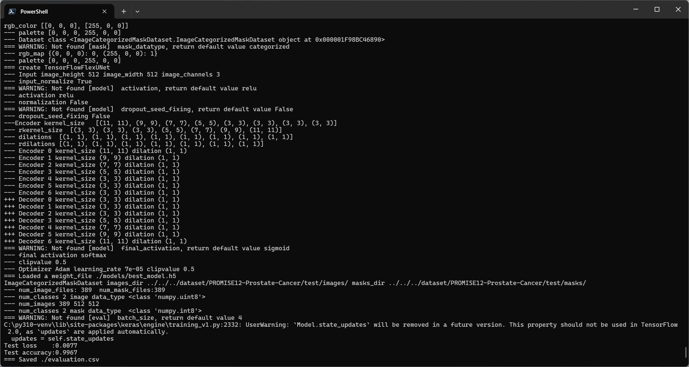
  Image-Segmentation-PROMISE12-Prostate-Cancer

<a href="./projects/TensorFlowFlexUNet/PROMISE12-Prostate-Cancer/evaluation.csv">evaluation.csv</a> 
The loss (categorical_crossentropy) to this <b>PROMISE12-Prostate-Cancer/test</b> was very low 
and dice_coef_multiclass very high as shown below.
 
<pre>
categorical_crossentropy,0.0077
dice_coef_multiclass,0.9967
</pre>
 
<h3>
5 Inference
</h3>
Please move to a <b>./projects/TensorFlowFlexUNet/PROMISE12-Prostate-Cancer</b> folder 
,and run the following bat file to infer segmentation regions for images by the Trained-TensorFlowUNet model for PROMISE12-Prostate-Cancer. 
<pre>
>./3.infer.bat
</pre>
This simply runs the following command.
<pre>
>python ../../../src/TensorFlowFlexUNetInferencer.py ./train_eval_infer_aug.config
</pre>

<b>mini_test_images</b> 
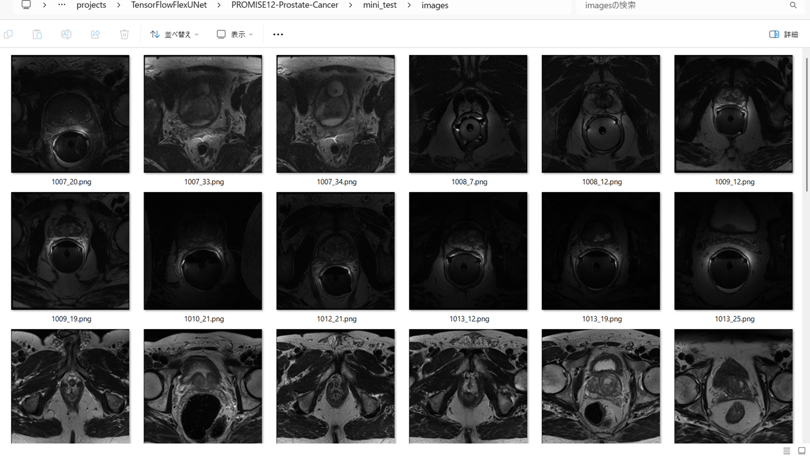 
<b>mini_test_mask(ground_truth)</b> 
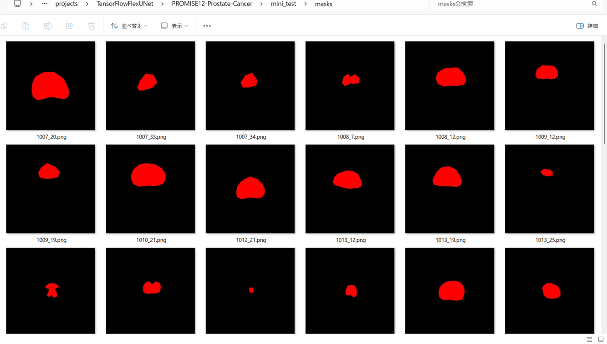 

<b>Inferred test masks</b> 
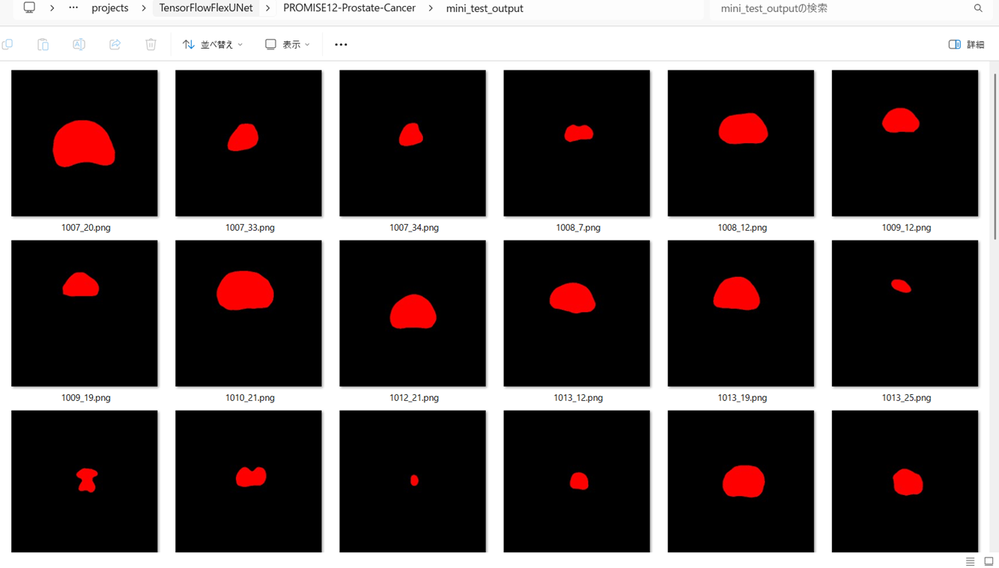 
 

<b>Enlarged images and masks of PROMISE12-Prostate-Cancer Images of 512x512 pixels</b> 
As shown below, the inferred masks predicted by our segmentation model trained by the dataset appear similar 
to the ground truth masks.
  
<table>
<tr>
<th>Image</th>
<th>Mask (ground_truth)</th>
<th>Inferred-mask</th>
</tr>
<tr>
<td>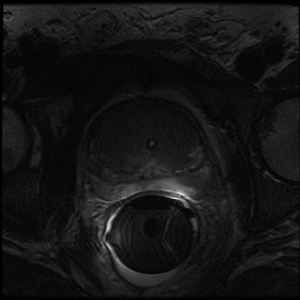</td>
<td>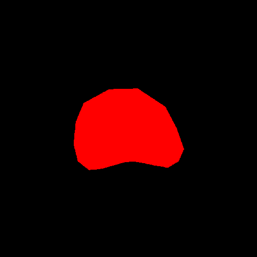</td>
<td>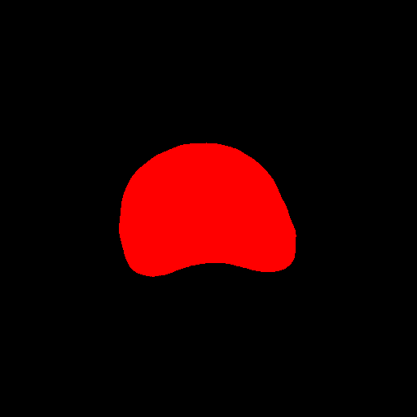</td>

</tr>

<tr>
<td>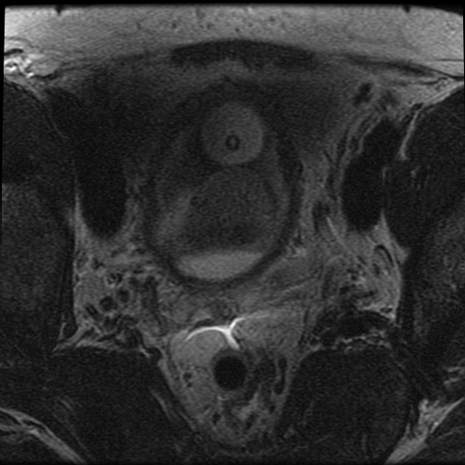</td>
<td>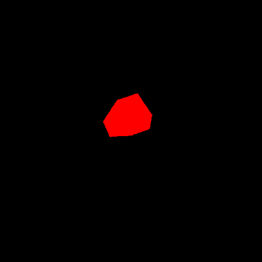</td>
<td></td>
</tr>

<tr>
<td>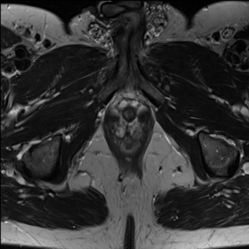</td>
<td></td>
<td></td>
</tr>

<tr>
<td>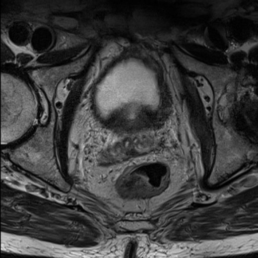</td>
<td>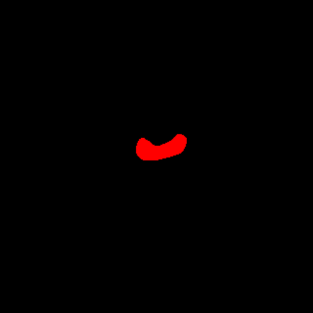</td>
<td></td>
</tr>

<tr>
<td>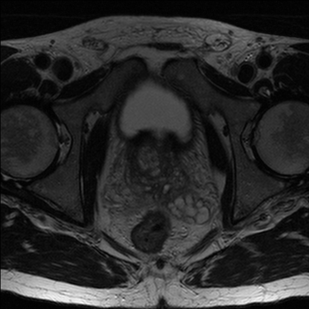</td>
<td></td>
<td></td>
</tr>

<tr>
<td></td>
<td></td>
<td></td>
</tr>
</table>

 
<h3>
References
</h3>
<b>1. Evaluation of prostate segmentation algorithms for MRI: The PROMISE12 challenge</b> 
Geert Litjens, Robert Toth, Wendy van de Ven, Caroline Hoeks, Sjoerd Kerkstra, Bram van Ginneken,  
Graham Vincent, Gwenael Guillard, Neil Birbeck, Jindang Zhang, Robin Strand, Filip Malmberg,  
Yangming Ou, Christos Davatzikos, Matthias Kirschner, Florian Jung, Jing Yuan, Wu Qiu, Qinquan Gao, 
 Philip “Eddie” Edwards, Bianca Maan, Ferdinand van der Heijden, Soumya Ghose, Jhimli Mitra, 
  Jason Dowling, Dean Barratt, Henkjan Huisman, Anant Madabhushi 
<a href="https://www.sciencedirect.com/science/article/abs/pii/S1361841513001734?via%3Dihub">
https://www.sciencedirect.com/science/article/abs/pii/S1361841513001734?via%3Dihub</a>
  

<b>2. TensorFlow-FlexUNet-Image-Segmentation-Prostate158-Prostate-Tumor-T2</b> 
Toshiyuki Arai 
<a href="https://github.com/sarah-antillia/TensorFlow-FlexUNet-Image-Segmentation-Prostate158-Prostate-Tumor-T2">
https://github.com/sarah-antillia/TensorFlow-FlexUNet-Image-Segmentation-Prostate158-Prostate-Tumor-T2</a>
  

<b>3. TensorFlow-FlexUNet-Image-Segmentation-Prostate-MRI</b> 
Toshiyuki Arai 
<a href="https://github.com/sarah-antillia/TensorFlow-FlexUNet-Image-Segmentation-Prostate-MRI">
https://github.com/sarah-antillia/TensorFlow-FlexUNet-Image-Segmentation-Prostate-MRI</a>
  
<b>4. TensorFlow-FlexUNet-Image-Segmentation-Model</b> 
Toshiyuki Arai 
<a href="https://github.com/sarah-antillia/TensorFlow-FlexUNet-Image-Segmentation-Model">
https://github.com/sarah-antillia/TensorFlow-FlexUNet-Image-Segmentation-Model</a>
  

